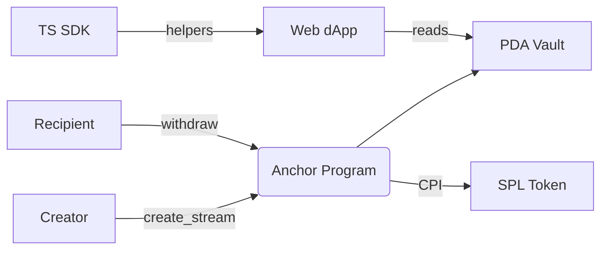
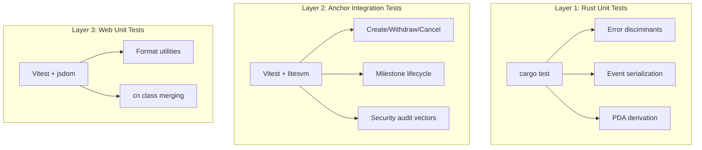

## Security Architecture & Test Coverage

**Token Distribution Protocol** on Solana

Program ID: `6VkmhxbTH9dnzAE7Scpxn6R3HeXYtY4oZffAFMAYvECk`

---

# What is TDP?

A protocol for creating, managing, and claiming **token vesting schedules** on Solana — replacing spreadsheets and manual multisig transfers with an on-chain Anchor program.



---

# Architecture Overview

```
monorepo/
├── apps/
│   ├── solana-tdp-anchor/   ← Anchor program (Rust)
│   ├── web/                 ← React frontend (Vite)
│   └── api/                 ← Cloudflare Worker
├── packages/
│   └── solana-tdp-sdk/      ← TypeScript SDK
└── docs/                    ← Architecture, deployment
```

- **Anchor 0.32.1** — on-chain vesting logic (7 instructions)
- **React + TanStack Router** — frontend dApp
- **TypeScript SDK** — PDA helpers, event parsing, vesting math

---

# Security Model — Core Design

| Design Decision                           | Purpose                                                                                           |
| ----------------------------------------- | ------------------------------------------------------------------------------------------------- |
| **PDA seeds include recipient**           | Cryptographically commits beneficiary to the PDA address — extra safety beyond Anchor's `has_one` |
| **Custom PDA vault (not ATA)**            | Fully closable on completion/cancellation — returns rent SOL                                      |
| **`invoke_signed` for all CPI transfers** | Only the program can move tokens via PDA signing                                                  |
| **Token-2022 transfer-hook rejection**    | Prevents mints with transfer hooks that could block CPI                                           |

---

# Security Model — Guardrails

| Guardrail                                             | Where                                          |
| ----------------------------------------------------- | ---------------------------------------------- |
| **Checked math** (`checked_mul`, `checked_div`, etc.) | All vesting calculations                       |
| **15 custom error codes**                             | Every invalid state transition                 |
| **60-second minimum duration**                        | Anti-griefing — prevents account space bloat   |
| **`cancelled` state set before CPI**                  | Reentrancy protection during cancel operations |
| **Cliff bounds validated against start/end**          | Prevents logical inconsistencies               |
| **Vesting count tracked per creator**                 | Prevents stream address collision              |

---

# Account Model

Three account types, all **Program-Derived Addresses**:

```
StreamAccount (187 bytes)
├── creator, recipient, mint, vault
├── amount, amount_withdrawn
├── start_time, end_time, cliff_time
├── vesting_count, cancelled, bump, vault_bump

MilestoneStreamAccount (196 bytes)
├── creator, recipient, mint, vault
├── amount, amount_withdrawn
├── milestone_authority, milestone_reached
├── vesting_count, cancelled, bump, vault_bump

CreatorConfig (48 bytes)
├── creator, vesting_count
```

**PDA seeds:** `["stream", creator, recipient, mint, vesting_count]`

---

# Testing Strategy — 3 Layers



---

# Layer 1 — Rust Unit Tests

Embedded program tests (`#[cfg(test)]`):

| File               | Tests | Coverage                                                                                                     |
| ------------------ | ----- | ------------------------------------------------------------------------------------------------------------ |
| `errors.rs`        | 2     | Error discriminant values, error messages for all 15 variants                                                |
| `events.rs`        | 4     | Serialization round-trips for 4 event types (StreamCreated, TokensClaimed, StreamCompleted, StreamCancelled) |
| `create_stream.rs` | 5     | PDA derivation determinism, vesting_count uniqueness, duration boundary, balance checks                      |

Run with: `cargo test`

---

# Layer 2 — Anchor Integration Tests

**Vitest** + **anchor-litesvm** (SVM simulator, no validator needed):

| Test File                    | Tests | Coverage                                                                                                                               |
| ---------------------------- | ----- | -------------------------------------------------------------------------------------------------------------------------------------- |
| `000.create-stream.test.ts`  | 9     | Happy path, cliff variant, 4 validation rejections, insufficient balance, event emission                                               |
| `001.withdraw.test.ts`       | 15    | Partial/full vesting, cumulative tracking, cliff/before-start/cancelled rejections, ExceedsClaimable, event, T/P third-party rejection |
| `002.cancel.test.ts`         | 8     | Pre-start/partial/post-end splits, double-cancel, event, account closure                                                               |
| `003.milestone.test.ts`      | 18    | Full milestone lifecycle: create, trigger, withdraw, cancel + events                                                                   |
| `005.security-audit.test.ts` | 19    | Dedicated security audit suite — **7 attack categories**                                                                               |

Custom alpha-sort sequencer ensures deterministic test order.

---

# Layer 3 — Web Unit Tests

**Vitest** + **jsdom** for frontend utilities:

| Test File        | Tests | Coverage                                                                                  |
| ---------------- | ----- | ----------------------------------------------------------------------------------------- |
| `format.test.ts` | 18    | `formatAddress` (3), `formatSol` (5), `formatDate` (2), `formatDuration` (6), `clamp` (3) |
| `cn.test.ts`     | 4     | Merging, conditional classes, Tailwind conflict resolution, empty input                   |

Setup: `@testing-library/jest-dom` matchers + `Buffer` polyfill

Run with: `pnpm test` in `apps/web/`

---

# Security Audit Test Suite — Deep Dive

**File:** `solana-tdp.005.security-audit.test.ts`

7 attack vector categories — **19 tests total**:

| #   | Category                    | Tests | What It Verifies                                                                                      |
| --- | --------------------------- | ----- | ----------------------------------------------------------------------------------------------------- |
| 1   | **Signer Authority**        | 3     | Non-sender rejected for create_milestone, non-creator for cancel_milestone, wrong sender for withdraw |
| 2   | **PDA Uniqueness**          | 4     | Different senders → different PDAs, vesting_count chain prevents collision                            |
| 3   | **Integer Overflow**        | 1     | Handles 10^16 amounts with vesting_count chain                                                        |
| 4   | **Account Ownership**       | 4     | Vault authority = stream PDA, mint constraint on withdraw/cancel                                      |
| 5   | **State Transition Guards** | 2     | `cancelled` set before CPI (reentrancy)                                                               |
| 6   | **Wrong Account Attacks**   | 4     | Rejects wrong vault PDA, wrong sender_token account                                                   |
| 7   | **Timestamp Boundaries**    | 1     | Rejects `create_stream` with past start_time                                                          |

---

# Attack Vectors — Detail

```
Signer Authority:
  ✗ CreateMilestoneStream with non-sender        → Unauthorized
  ✗ CancelMilestone with non-creator             → Unauthorized
  ✗ Withdraw with wrong sender account           → constraint raw 1

PDA Uniqueness:
  ✗ Same stream PDA for different senders        → address not unique
  ✗ Identical vault PDAs for different streams   → address not unique
  ✓ vesting_count increments → unique stream PDA

Integer Overflow:
  ✓ 10,000,000,000,000,000 lamports
  ✓ vesting_count chains across streams

Account Ownership:
  ✗ Vault owned by wrong PDA                     → TokenOwnerOff
  ✗ Withdraw with different mint vault           → constraint raw 1
  ✗ Cancel with different mint vault             → constraint raw 1
```

---

# Pre-commit Security Gates

Every commit runs automatically:

```
┌─ nano-staged ──────────────────────────┐
│  *.{js,ts,tsx} → oxlint --fix + oxfmt  │
│  *.{css,md,json} → oxfmt               │
└─────────────────────────────────────────┘
┌─ TypeScript typecheck ─────────────────┐
│  web: tsgo --noEmit                    │
│  api: typecheck                        │
│  anchor: tsgo --noEmit                 │
└─────────────────────────────────────────┘
┌─ Rust checks ──────────────────────────┐
│  cargo fmt --check                     │
│  cargo clippy --all-targets -D warnings│
└─────────────────────────────────────────┘
```

**Oxlint** rules: `no-explicit-any` (error), `no-non-null-assertion` (error), `import/no-cycle` (error), `no-console` (warn)

---

# CI/CD Security Pipeline

**GitHub Actions** — 13 jobs on push/PR to `main`:

| Job                   | Guard                                                  |
| --------------------- | ------------------------------------------------------ |
| `typecheck-web`       | TypeScript strict checks                               |
| `typecheck-api`       | Worker type safety                                     |
| `typecheck-sdk`       | SDK type safety                                        |
| `typecheck-anchor-ts` | Test code type safety                                  |
| `lint`                | `oxlint .` (304 rules)                                 |
| `format`              | `oxfmt --check .`                                      |
| `lint-rust`           | `cargo fmt --check` + `cargo clippy`                   |
| `build-web`           | Production Vite build                                  |
| `test-api`            | API tests with vitest                                  |
| `test-web`            | Web unit + Storybook browser tests                     |
| `anchor`              | `cargo fmt` + `clippy` + `anchor build` + vitest tests |
| `deploy-web`          | Cloudflare Pages (main only)                           |
| `deploy-api`          | Cloudflare Worker (main only)                          |

---

# Known Gaps & Future Work

| Gap                                      | Impact                                            | Suggested Remediation                               |
| ---------------------------------------- | ------------------------------------------------- | --------------------------------------------------- |
| **No dependency vulnerability scanning** | Supply-chain risk from compromised npm/crates     | Add `npm audit` / `cargo audit` or Dependabot to CI |
| **No formal verification**               | Mathematical correctness of vesting math unproven | SMT solver (Z3) on vesting formulas                 |
| **No fuzzing**                           | Edge cases in account deserialization             | `trident` fuzzing harness for Anchor                |
| **No manual audit**                      | No third-party review of the economic logic       | Professional Solana security audit                  |
| **No invariant testing**                 | Cross-instruction invariants untested             | Fuzz testing with state invariants                  |

---

# Appendix — Full Test Coverage Map

| Test File                    | Instructions/Utilities                  | Layer       | Tests    |
| ---------------------------- | --------------------------------------- | ----------- | -------- |
| `errors.rs`                  | Error discriminant stability            | Rust unit   | 2        |
| `events.rs`                  | Event serialization round-trips         | Rust unit   | 4        |
| `create_stream.rs`           | PDA derivation, vesting math            | Rust unit   | 5        |
| `000.create-stream.test.ts`  | `create_stream`                         | Integration | 9        |
| `001.withdraw.test.ts`       | `withdraw`                              | Integration | 15       |
| `002.cancel.test.ts`         | `cancel`                                | Integration | 8        |
| `003.milestone.test.ts`      | Milestone lifecycle (4 ixns)            | Integration | 18       |
| `005.security-audit.test.ts` | 7 attack categories (all ixns)          | Integration | 19       |
| `format.test.ts`             | `formatAddress/Sol/Date/Duration/clamp` | Web unit    | 18       |
| `cn.test.ts`                 | `cn()` class merging                    | Web unit    | 4        |
| **Total**                    |                                         |             | **~147** |

---

**Solana TDP** — Token Distribution Protocol

- Program: `6VkmhxbTH9dnzAE7Scpxn6R3HeXYtY4oZffAFMAYvECk`
- Repo: `github.com/simplyvest/simplyvest`
- Tests: `pnpm test` (all workspaces)
- Build: `pnpm build` (all workspaces)
