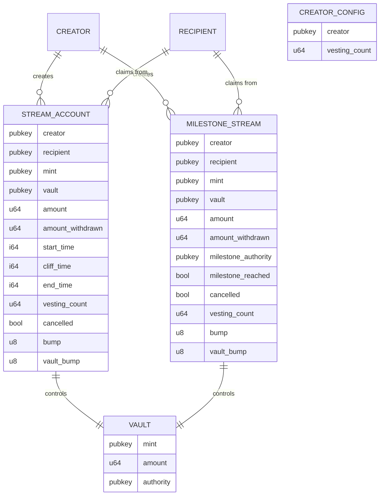
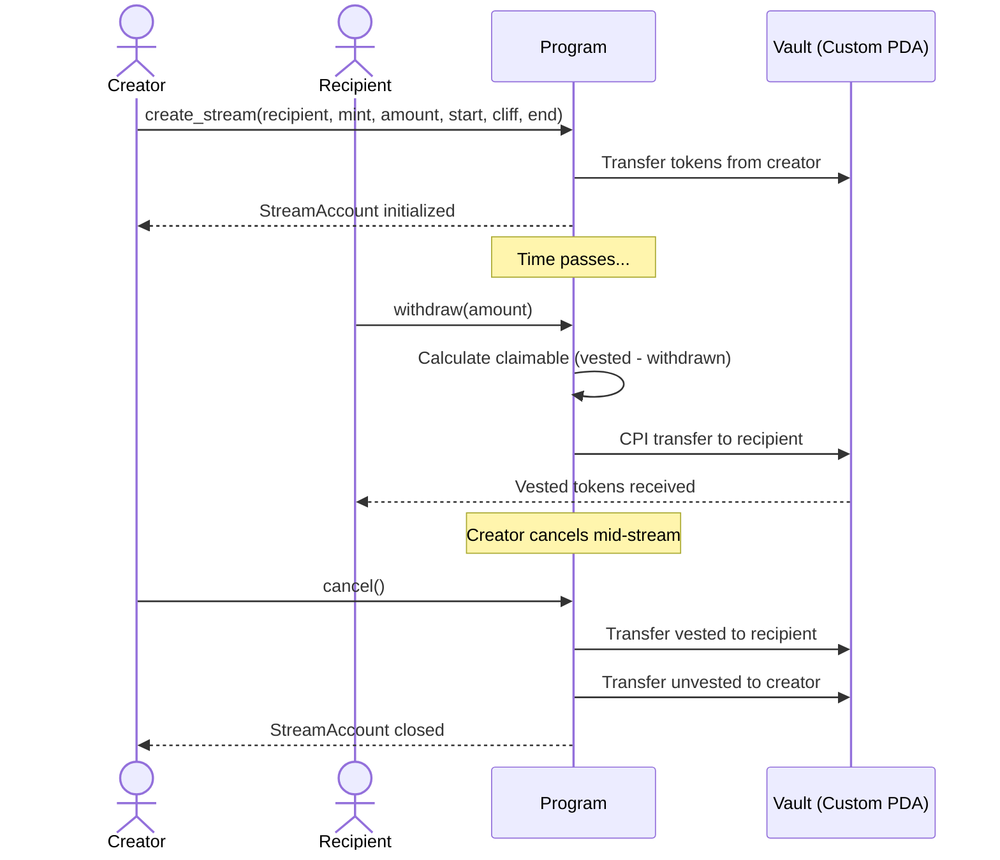
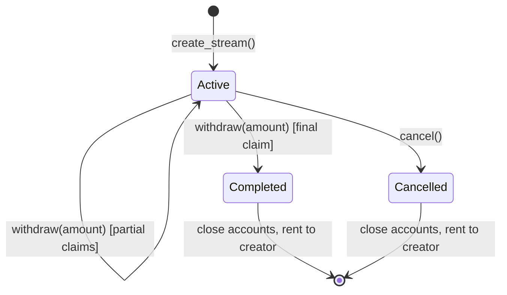

# Architecture — Solana Token Distribution Protocol

This document describes the on-chain protocol architecture: account model, PDA seeds, program instructions, data flow, events, and error reference.

_This document describes the planned protocol architecture. The implementation is in progress — details may change during development._

## Contents

1. [Account structure](#account-structure)
2. [PDA seeds](#pda-seeds)
3. [Program instructions](#program-instructions)
4. [Data flow](#data-flow)
5. [Edge cases](#edge-cases)
6. [Events](#events)
7. [Error reference](#error-reference)

8. [Design Decisions](#design-decisions)

---

## Account structure

The protocol uses four on-chain account types:

- **StreamAccount PDA** — stores the metadata for a single time-based vesting stream
- **MilestoneStream PDA** — stores the metadata for a single milestone-gated vesting stream
- **Vault Token Account** — a custom PDA token account that holds the locked tokens
- **CreatorConfig PDA** — a per-creator account tracking the next vesting nonce

The StreamAccount PDA is the authority over the vault. Only the program (signing with PDA seeds via `invoke_signed`) can move tokens out.

### Entity relationship



### StreamAccount PDA

One per vesting stream. Created at `create_stream` time and closed when the stream completes (final `withdraw`) or is cancelled. Status is derived at read time — only `cancelled: bool` is stored.

| Field              | Type            | Purpose                                                     |
| ------------------ | --------------- | ----------------------------------------------------------- | -------------------------------------- |
| `creator`          | `Pubkey`        | Wallet that funded the stream. Only this wallet can cancel. |
| `recipient`        | `Pubkey`        | Wallet that receives vested tokens. Immutable once created. |
| `mint`             | `Pubkey`        | SPL Token or Token-2022 mint address.                       |
| `vault`            | `Pubkey`        | Escrow token account address (cached for self-description). |
| `amount`           | `u64`           | Total tokens locked in this stream.                         |
| `amount_withdrawn` | `u64`           | Tokens already claimed by the recipient.                    |
| `start_time`       | `i64`           | Unix timestamp when vesting begins.                         |
| `end_time`         | `i64`           | Unix timestamp when the full amount is vested.              |
| `cliff_time`       | `i64`           | Unix timestamp of cliff; 0 means no cliff.                  |
|                    | `vesting_count` | `u64`                                                       | Nonce used in this stream's PDA seeds. |
| `cancelled`        | `bool`          | True if the creator cancelled the stream.                   |
| `bump`             | `u8`            | Stream PDA bump seed, stored to avoid re-derivation.        |
| `vault_bump`       | `u8`            | Vault PDA bump seed, stored to avoid re-derivation.         |

**Account size:** 187 bytes (8 anchor discriminator + 128 pubkeys + 48 integers + 3 bool/u8).

### Vault Token Account

A custom PDA token account created with seeds `["vault", stream.key()]`. The vault is initialized via the Token Program as a standard token account with the Stream PDA as authority.

Chosen over an ATA because a custom PDA can be fully closed on stream completion or cancellation, returning the rent-exempt SOL to the creator. An ATA would remain on-chain permanently, locking rent.

**Seeds:** `["vault", stream.key().as_ref()]`

### CreatorConfig PDA

One per creator wallet. Created lazily on the first `create_stream` or `create_milestone_stream` call via Anchor's `init_if_needed`. Stores a sequential nonce that increments on each `create_stream` and `create_milestone_stream`, enabling multiple streams between the same creator and recipient for the same mint.

| Field     | Type            | Purpose                 |
| --------- | --------------- | ----------------------- | ------------------------------------- |
| `creator` | `Pubkey`        | Creator wallet address. |
|           | `vesting_count` | `u64`                   | Next sequential nonce, starting at 0. |

**Account size:** 48 bytes (8 discriminator + 32 pubkey + 8 u64).

### MilestoneStream PDA

One per milestone-gated vesting stream. Created at `create_milestone_stream` time and closed when the stream completes (final `withdraw_milestone`) or is cancelled. Status is derived at read time — `milestone_reached` gates withdrawal, `cancelled` prevents further actions.

| Field                 | Type     | Purpose                                                       |
| --------------------- | -------- | ------------------------------------------------------------- |
| `creator`             | `Pubkey` | Wallet that funded the stream. Only this wallet can cancel.   |
| `recipient`           | `Pubkey` | Wallet that receives vested tokens. Immutable once created.   |
| `mint`                | `Pubkey` | SPL Token or Token-2022 mint address.                         |
| `vault`               | `Pubkey` | Escrow token account address (cached for self-description).   |
| `amount`              | `u64`    | Total tokens locked in this stream.                           |
| `amount_withdrawn`    | `u64`    | Tokens already claimed by the recipient.                      |
| `milestone_authority` | `Pubkey` | Wallet authorized to trigger `milestone_reached`.             |
| `milestone_reached`   | `bool`   | True once the milestone authority triggers the release.       |
| `cancelled`           | `bool`   | True if the creator cancelled the milestone stream.           |
| `vesting_count`       | `u64`    | Nonce used in this stream's PDA seeds.                        |
| `bump`                | `u8`     | MilestoneStream PDA bump seed, stored to avoid re-derivation. |
| `vault_bump`          | `u8`     | Vault PDA bump seed, stored to avoid re-derivation.           |

## **Account size:** 196 bytes (8 anchor discriminator + 160 pubkeys + 24 integers + 4 bool/u8).

## PDA seeds

| Account       | Seeds                         | Notes                                                           |
| ------------- | ----------------------------- | --------------------------------------------------------------- | ---------------------------------- |
| CreatorConfig | `["creator_config", creator]` | One per creator wallet                                          |
|               | StreamAccount                 | `["stream", creator, recipient, mint, vesting_count]`           | `vesting_count` from CreatorConfig |
| Vault         | `["vault", stream.key()]`     | Escrow token account                                            |
|               | MilestoneStream               | `["milestone-stream", creator, recipient, mint, vesting_count]` | `vesting_count` from CreatorConfig |

The `vesting_count` is a sequential nonce that lets the same creator fund multiple streams and milestone streams for the same recipient and mint without address collisions. It increments on each `create_stream` and `create_milestone_stream` call.

> **Why recipient in the seed?** The PDA address cryptographically commits to the beneficiary. Even if account data were somehow corrupted, the address itself proves who the stream is for. This is an extra safety invariant beyond Anchor's `has_one` constraint.

> **Why mint in the seed?** Prevents collisions between streams for different tokens to the same recipient.

StreamAccount PDA derivation:

```
seeds = [b"stream", creator.key(), recipient.key(), mint.key(), &vesting_count.to_le_bytes()]
```

MilestoneStream PDA derivation:

```
seeds = [b"milestone-stream", creator.key(), recipient.key(), mint.key(), &vesting_count.to_le_bytes()]
```

Vault PDA derivation:

```
seeds = [b"vault", stream.key()]
```

---

## Program instructions

### create_stream

Initialize a new vesting stream. The creator specifies the amount, time parameters, recipient, and token mint. Tokens are transferred from the creator's token account into a newly created vault PDA.

- **Caller:** Creator (signer)
- **Parameters:** `{ amount, start_time, end_time, cliff_time }` — `recipient` and `mint` are derived from accounts
- **Accounts:** Creator (signer, mut), Recipient, Mint, CreatorConfig (init_if_needed, mut), StreamAccount (init, mut), Vault (init, mut), CreatorTokenAccount (mut), TokenProgram, SystemProgram, Rent sysvar

**Validations:**

| Condition                                                                  | Error                     |
| -------------------------------------------------------------------------- | ------------------------- |
| `amount == 0`                                                              | `ZeroAmount`              |
| `end_time <= start_time`                                                   | `InvalidTimeRange`        |
| `cliff_time != 0 && (cliff_time <= start_time \|\| cliff_time > end_time)` | `InvalidCliffTime`        |
| `end_time - start_time < 60` (seconds)                                     | `DurationTooShort`        |
| Creator token balance < `amount`                                           | `InsufficientBalance`     |
| `start_time <= clock`                                                      | `StartTimeInPast`         |
| Mint owner is neither SPL Token nor Token-2022 program                     | `UnsupportedTokenProgram` |
| Token-2022 mint has transfer-hook extension                                | `TokenHasTransferHook`    |

**Effects:**

1. Create CreatorConfig PDA if it does not exist.
2. Derive StreamAccount PDA from seed components and `CreatorConfig.vesting_count`.
3. Initialize StreamAccount with supplied parameters and store the current `vesting_count` value. Set `cancelled = false`.
4. Initialize vault as a custom PDA token account with Stream PDA as authority.
5. Transfer `amount` tokens from creator's token account to vault via CPI.
6. Increment `CreatorConfig.vesting_count`.
7. Emit `StreamCreated` event.

**Error codes:** `ZeroAmount`, `InvalidTimeRange`, `InvalidCliffTime`, `DurationTooShort`, `InsufficientBalance`, `StartTimeInPast`, `UnsupportedTokenProgram`, `TokenHasTransferHook`

### withdraw

Let the recipient claim a specific amount of vested tokens. Calculates the total claimable amount based on current clock time, the vesting curve, and amount already claimed, then validates that the requested amount does not exceed the claimable.

- **Caller:** Recipient (signer)
- **Parameters:** `{ amount: u64 }` — amount of tokens to claim (must be > 0 and <= total claimable)
- **Accounts:** Recipient (signer, mut), Sender (unchecked, mut, rent return), Mint, StreamAccount (mut), Vault (mut), RecipientTokenAccount (init_if_needed, mut), TokenProgram, AssociatedTokenProgram, SystemProgram

**Validations:**

| Condition                      | Error               |
| ------------------------------ | ------------------- |
| Status is Cancelled            | `AlreadyCancelled`  |
| Clock timestamp < `cliff_time` | `CliffNotReached`   |
| Calculated claimable == 0      | `NothingToWithdraw` |
| `amount > claimable`           | `ExceedsClaimable`  |

**Claimable calculation:**

```
if clock < cliff_time:
    claimable = 0
else:
    elapsed = clock - start_time
    duration = end_time - start_time
    vested = min(amount * elapsed / duration, amount)
    claimable = vested - amount_withdrawn
```

Integer division truncates toward zero. Any remainder is claimed on the final withdrawal (when `clock >= end_time`, `elapsed / duration = 1`, so `vested = amount`).

**Effects:**

1. Create recipient's ATA via CPI if it does not exist (payer = recipient).
2. Validate `amount > 0` and `amount <= claimable`. Reject with `ExceedsClaimable` if exceeded.
3. Transfer `amount` tokens from vault to recipient's ATA via `invoke_signed`.
4. Update `StreamAccount.amount_withdrawn += amount`.
5. Emit `TokensClaimed` event.
6. If `amount_withdrawn == amount` after the update (final withdrawal):
   - Close vault token account via CPI `close_account`: rent SOL to sender.
   - Close StreamAccount: zero data and transfer rent SOL to sender.
   - Emit `StreamCompleted` event.

**Error codes:** `AlreadyCancelled`, `CliffNotReached`, `NothingToWithdraw`, `ExceedsClaimable`

### cancel

Let the creator cancel an active stream. Recipient receives whatever has vested (including unclaimed). Creator receives the unvested portion. Both accounts are closed immediately.

- **Caller:** Creator (signer)
- **Parameters:** none
- **Accounts:** Creator (signer, mut), Recipient (unchecked), Mint, StreamAccount (mut), Vault (mut), CreatorTokenAccount (mut), RecipientTokenAccount (init_if_needed, mut), TokenProgram, AssociatedTokenProgram, SystemProgram

**Validations:**

| Condition                     | Error              |
| ----------------------------- | ------------------ |
| Caller is not `creator`       | `Unauthorized`     |
| Status is Cancelled           | `AlreadyCancelled` |
| Clock timestamp >= `end_time` | `StreamExpired`    |

**Effects:**

1. Calculate vested amount (same formula as `withdraw`).
2. Calculate recipient's unclaimed vested share = `vested_amount - amount_withdrawn`.
3. Calculate unvested share = `amount - vested_amount` (returned to creator).
4. Create recipient's ATA via `init_if_needed` if it does not exist (payer = creator).
5. Transfer recipient share from vault to recipient's ATA via `invoke_signed`.
6. Transfer unvested share from vault to creator's token account via `invoke_signed`.
7. Emit `StreamCancelled` event.
8. Close vault token account via CPI `close_account`: rent SOL to creator.
9. Close StreamAccount: zero data and transfer rent SOL to creator.
   **Error codes:** `Unauthorized`, `AlreadyCancelled`, `StreamExpired`

### create_milestone_stream

Initialize a new milestone-gated vesting stream. The creator specifies the recipient, token mint, amount, and milestone authority. Tokens are transferred from the creator's token account into a newly created vault PDA. No time parameters — withdrawal is gated by `milestone_reached` rather than a vesting schedule.

- **Caller:** Creator (signer)
- **Parameters:** `recipient`, `mint`, `amount`, `milestone_authority`
- **Accounts:** Creator (signer, mut), Recipient, MilestoneAuthority, CreatorConfig (init_if_needed, mut), MilestoneStream (init, mut), Vault (init, mut), CreatorTokenAccount (mut), Mint, TokenProgram, SystemProgram, Rent sysvar

**Validations:**

| Condition                                              | Error                     |
| ------------------------------------------------------ | ------------------------- |
| `amount == 0`                                          | `ZeroAmount`              |
| Creator token balance < `amount`                       | `InsufficientBalance`     |
| Mint owner is neither SPL Token nor Token-2022 program | `UnsupportedTokenProgram` |
| Token-2022 mint has transfer-hook extension            | `TokenHasTransferHook`    |

**Effects:**

1. Create CreatorConfig PDA if it does not exist.
2. Derive MilestoneStream PDA from seed components and `CreatorConfig.vesting_count`.
3. Initialize MilestoneStream with supplied parameters and store the current `vesting_count` value. Set `milestone_reached = false`, `cancelled = false`.
4. Initialize vault as a custom PDA token account with MilestoneStream PDA as authority.
5. Transfer `amount` tokens from creator's token account to vault via CPI.
6. Increment `CreatorConfig.vesting_count`.
7. Emit `MilestoneStreamCreated` event.

**Error codes:** `ZeroAmount`, `InsufficientBalance`, `UnsupportedTokenProgram`, `TokenHasTransferHook`

### trigger_milestone

Let the milestone authority mark a milestone stream as reached. Once triggered, the recipient can withdraw all tokens. This is a one-way gate — once `milestone_reached` is set, it cannot be unset.

- **Caller:** MilestoneAuthority (signer)
- **Parameters:** none
- **Accounts:** MilestoneAuthority (signer), MilestoneStream (mut), Clock sysvar

**Validations:**

| Condition                           | Error              |
| ----------------------------------- | ------------------ |
| Caller is not `milestone_authority` | `Unauthorized`     |
| Status is Cancelled                 | `AlreadyCancelled` |
| `milestone_reached == true`         | `FullyVested`      |

**Effects:**

1. Set `MilestoneStream.milestone_reached = true`.
2. Emit `MilestoneTriggered` event.

**Error codes:** `Unauthorized`, `AlreadyCancelled`, `FullyVested`

### withdraw_milestone

Let the recipient withdraw the full stream amount after the milestone has been reached. Unlike time-based `withdraw`, there is no partial claiming — the entire amount is released at once.

- **Caller:** Recipient (signer)
- **Parameters:** none
- **Accounts:** Recipient (signer, mut), Creator (unchecked, mut, rent return), MilestoneStream (mut, close), Vault (mut, close), RecipientTokenAccount (init_if_needed, mut), TokenProgram, AssociatedTokenProgram, SystemProgram, Clock sysvar

**Validations:**

| Condition                    | Error               |
| ---------------------------- | ------------------- |
| Status is Cancelled          | `AlreadyCancelled`  |
| `milestone_reached == false` | `NothingToWithdraw` |
| `amount_withdrawn > 0`       | `FullyVested`       |

**Effects:**

1. Create recipient's ATA via CPI if it does not exist (payer = recipient).
2. Transfer `amount - amount_withdrawn` tokens from vault to recipient's ATA via `invoke_signed`.
3. Update `MilestoneStream.amount_withdrawn = amount`.
4. Emit `MilestoneCompleted` event.
5. Close MilestoneStream: return rent SOL to creator.
6. Close Vault: return rent SOL to creator.

**Error codes:** `AlreadyCancelled`, `NothingToWithdraw`, `FullyVested`

### cancel_milestone

Let the creator cancel an active milestone stream before the milestone is reached. Creator receives the full `amount` back. Recipient receives nothing (no time-based vesting has occurred). Both accounts are closed immediately.

- **Caller:** Creator (signer)
- **Parameters:** none
- **Accounts:** Creator (signer, mut), Recipient (unchecked), MilestoneStream (mut, close), Vault (mut, close), CreatorTokenAccount (mut), TokenProgram, SystemProgram, Clock sysvar

**Validations:**

| Condition                   | Error              |
| --------------------------- | ------------------ |
| Caller is not `creator`     | `Unauthorized`     |
| Status is Cancelled         | `AlreadyCancelled` |
| `milestone_reached == true` | `FullyVested`      |

**Effects:**

1. Transfer `amount - amount_withdrawn` tokens from vault to creator's token account via `invoke_signed`.
2. Emit `MilestoneCancelled` event.
3. Close MilestoneStream: return rent SOL to creator.
4. Close Vault: return rent SOL to creator.

## **Error codes:** `Unauthorized`, `AlreadyCancelled`, `FullyVested`

## Data flow

### Happy path lifecycle



### StreamAccount state machine



### Clock dependency

Vesting calculations depend on Solana's `Clock` sysvar `unix_timestamp`. No oracle needed — the blockchain itself provides timestamps. Solana slots are roughly 400ms, giving per-second resolution for streaming.

### CPI patterns

**Token transfer (withdraw/cancel):**
Uses `invoke_signed` with both Stream and Vault PDA seeds. The Stream PDA is the authority over the vault, so the program must prove it is the one authorizing the transfer. Seeds are reconstructed from the stored `bump`, `vault_bump`, and stored account fields.

**ATA creation (withdraw/cancel):**
If the recipient has no ATA for the vesting token, the program creates one via CPI to the Associated Token Program and Token Program. The payer is the instruction caller (recipient for `withdraw`, creator for `cancel`).

**Account closure (withdraw completion / cancel):**
StreamAccount and Vault are closed manually after the final withdrawal or cancel. The vault token account is closed via CPI to the Token Program's `close_account` instruction. The StreamAccount data is zeroed and its rent-exempt SOL is transferred to the sender. Anchor's `close` constraint is not used because closure is conditional (only on final withdrawal), not unconditional at the accounts-struct level.

### Batch creation strategy

The program supports single-stream creation only (`create_stream`). Batch creation is handled at the SDK level:

1. The SDK derives all stream PDA addresses upfront using predicted `vesting_count` values.
2. Multiple `create_stream` instructions are packed into a single transaction (typically 3–4 per transaction due to Solana's ~1232 byte tx size limit).
3. Solana sequentially executes instructions in a transaction — `CreatorConfig.vesting_count` is incremented after each instruction, so the next instruction picks up the incremented value.
4. Each chunk is one signature, one base fee, and atomic all-or-nothing.

This avoids complexity in the on-chain program while providing near-atomic batch creation for large teams.

### Token-2022 handling

At `create_stream`, the program checks:

1. **Mint owner:** Must be either the SPL Token program (`Tokenkeg...`) or Token-2022 program (`Tokenz...`).
2. **Transfer-hook rejection:** If the mint is Token-2022 and has an active transfer-hook extension, creation is rejected with `TokenHasTransferHook`. Transfer hooks can block CPI transfers, causing silent failures during `withdraw` and `cancel`.

Standard SPL Token mints pass through without additional checks.

---

## Edge cases

| #   | Scenario                             | Input                              | Expected behavior                               | Error                  |
| --- | ------------------------------------ | ---------------------------------- | ----------------------------------------------- | ---------------------- |
| 1   | Withdraw before cliff                | `clock < cliff_time`               | Reject claim                                    | `CliffNotReached`      |
| 2   | Cancel mid-stream                    | 40% vested                         | 40% → recipient, 60% → creator, accounts closed | —                      |
| 3   | Zero amount create                   | `amount = 0`                       | Reject creation                                 | `ZeroAmount`           |
| 4   | Fully vested, unclaimed              | `end_time` passed, `withdrawn = 0` | Cancel rejected → use withdraw                  | `StreamExpired`        |
| 5   | Self-vesting                         | `recipient == creator`             | Allowed — trial or self-reward use case         | —                      |
| 6   | Multiple streams, same pair          | Same creator/recipient/mint        | Differentiated by `vesting_count` nonce         | —                      |
| 7   | No recipient ATA                     | Recipient has no token account     | Created via CPI at withdraw/cancel time         | —                      |
| 8   | Cancel by non-creator                | Caller is not `creator`            | Reject                                          | `Unauthorized`         |
| 9   | Withdraw after fully claimed         | `withdrawn == amount`              | Reject                                          | `NothingToWithdraw`    |
| 10  | Cancel cancelled stream              | Status is Cancelled                | Reject                                          | `AlreadyCancelled`     |
| 11  | Cancel after end_time                | Clock >= `end_time`                | Reject                                          | `StreamExpired`        |
| 12  | Duration less than 60 seconds        | `end - start < 60`                 | Reject creation                                 | `DurationTooShort`     |
| 13  | Token-2022 with transfer hook        | Mint has transfer-hook extension   | Reject creation                                 | `TokenHasTransferHook` |
| 14  | Overflow handling                    | Large `amount`                     | Safe math via Rust checked arithmetic           | —                      |
| 15  | Integer rounding at final claim      | Truncated fractional tokens        | Remainder claimed on final `withdraw`           | —                      |
| 16  | Withdraw amount exceeds claimable    | `amount > claimable`               | Reject partial claim                            | `ExceedsClaimable`     |
| 17  | Create stream with past `start_time` | `start_time <= clock`              | Reject creation                                 | `StartTimeInPast`      |
| 18  | Trigger already-triggered milestone  | `milestone_reached == true`        | Reject trigger                                  | `FullyVested`          |
| 19  | Withdraw milestone before trigger    | `milestone_reached == false`       | Reject withdraw                                 | `NothingToWithdraw`    |
| 20  | Cancel milestone after triggered     | `milestone_reached == true`        | Reject cancel                                   | `FullyVested`          |

---

## Events

Events are emitted via Anchor's `emit!` macro and parsed from transaction logs by the SDK. Events are the authoritative on-chain record of stream activity — since accounts are fully closed on completion or cancellation, indexers rely on events to reconstruct stream history.

**SDK responsibility:** The TypeScript SDK provides event parsing, PDA derivation helpers, computed status/claimable getters, and instruction builders. Frontend code should never derive PDAs or calculate vesting amounts directly — all math lives in the SDK.

| Event                    | Fields                                                                                     | When                                                          |
| ------------------------ | ------------------------------------------------------------------------------------------ | ------------------------------------------------------------- |
| `StreamCreated`          | `stream`, `creator`, `recipient`, `mint`, `amount`, `start_time`, `cliff_time`, `end_time` | On successful `create_stream`                                 |
| `TokensClaimed`          | `stream`, `recipient`, `amount`, `claimed`, `total_claimed`                                | On every `withdraw` (including final)                         |
| `StreamCompleted`        | `stream`, `recipient`, `total_amount`                                                      | On `withdraw` when fully vested — followed by account closure |
| `StreamCancelled`        | `stream`, `creator`, `recipient`, `vested_to_recipient`, `returned_to_creator`             | On `cancel` — followed by account closure                     |
| `MilestoneStreamCreated` | `stream`, `creator`, `recipient`, `mint`, `amount`, `milestone_authority`                  | On successful `create_milestone_stream`                       |
| `MilestoneTriggered`     | `stream`, `milestone_authority`                                                            | On successful `trigger_milestone`                             |
| `MilestoneCompleted`     | `stream`, `recipient`, `total_amount`                                                      | On `withdraw_milestone` — followed by account closure         |
| `MilestoneCancelled`     | `stream`, `creator`, `recipient`, `returned_to_creator`                                    | On `cancel_milestone` — followed by account closure           |

---

## Error reference

| Error                     | Cause                                                                                           |
| ------------------------- | ----------------------------------------------------------------------------------------------- |
| `ZeroAmount`              | `amount` is 0                                                                                   |
| `InvalidTimeRange`        | `end_time <= start_time`                                                                        |
| `InvalidCliffTime`        | `cliff_time` is before `start_time` or after `end_time` (or equal to `end_time` for pure cliff) |
| `DurationTooShort`        | `end_time - start_time < 60` seconds (anti-griefing minimum)                                    |
| `InsufficientBalance`     | Sender does not have enough token balance                                                       |
| `UnsupportedTokenProgram` | Mint owner is neither SPL Token nor Token-2022                                                  |
| `TokenHasTransferHook`    | Token-2022 mint has a transfer-hook extension (would block CPI)                                 |
| `CliffNotReached`         | Withdraw attempted before `cliff_time`                                                          |
| `NothingToWithdraw`       | No tokens available to withdraw, milestone not reached, or milestone already triggered          |
| `AlreadyCancelled`        | Operation attempted on an already-cancelled stream                                              |
| `FullyVested`             | Milestone already reached (trigger/cancel milestone)                                            |
| `StartTimeInPast`         | `create_stream` called with a `start_time` in the past                                          |
| `StreamExpired`           | Cancel attempted after `end_time` — use withdraw instead                                        |
| `ExceedsClaimable`        | Withdraw amount exceeds the claimable total                                                     |
| `Unauthorized`            | Non-creator, non-recipient, or non-authority caller                                             |

---

## Design Decisions

Each decision documents the alternatives considered and why the chosen approach was selected. Knowing what was ruled out is as important as knowing what was picked — it tells a future reader when to revisit.

### StreamAccount (vs VestingSchedule, StreamSchedule)

**Alternatives considered:** "VestingSchedule" (architecture documentation), "StreamSchedule", "DistributionStream".

**Rationale:** "Stream" is shorter than "VestingSchedule" for a frequently-referenced type. It matches the code convention (the stub used `StreamAccount`) and aligns with industry conventions (Streamflow, streaming vesting). The terms "vesting" and "schedule" add no semantic value — the protocol only does vesting, and every stream has its own schedule implicitly.

**Trade-off:** Replaces a self-documenting name with a shorter one. The domain glossary (CONTEXT.md) compensates.

### PDA seeds: recipient and mint in the derivation path

**Alternatives considered:**

1. `["vesting", creator, mint, vesting_count]` (architecture documentation) — recipient is not in seeds, verified via `has_one` constraint.
2. `["stream", sender, recipient]` (stub code) — one stream per (sender, recipient) pair max; no mint in seeds means cross-token collisions.
3. `["stream", creator, recipient, mint, vesting_count]` (chosen).

**Rationale:** Putting recipient in the seed cryptographically commits the beneficiary to the PDA address itself — an extra safety invariant beyond Anchor's `has_one`. Mint in the seed prevents address collisions between streams for different tokens sent to the same recipient. The `vesting_count` nonce (per-creator) allows unlimited streams for the same (creator, recipient, mint) triple.

**Trade-off:** The recipient cannot be changed after creation without closing and recreating the stream. This is intentional — recipient immutability is a protocol invariant, not a limitation.

### Vault: custom PDA token account (vs Associated Token Account)

**Alternatives considered:**

1. ATA (architecture documentation) — wallet-compatible, auto-discovered by explorers.
2. Custom PDA token account `["vault", stream.key()]` (chosen).

**Rationale:** A custom PDA can be fully closed on stream completion or cancellation, returning the rent-exempt SOL to the creator. An ATA would remain on-chain permanently, locking ~0.002 SOL per stream indefinitely. At 1,000 completed streams that is ~2 SOL locked with no way to reclaim it.

**Trade-off:** Custom PDAs are not auto-discovered by wallets and explorers. Users must derive the vault address from the stream PDA. The SDK provides a derivation helper for this.

### Token standard: SPL Token + Token-2022 (vs SPL-only)

**Alternatives considered:**

1. SPL-only — simpler program, fewer failure modes.
2. Both SPL Token and Token-2022 with validation gate (chosen).

**Rationale:** Token-2022 adoption is growing. New tokens increasingly launch with Token-2022 features (metadata extensions, transfer hooks). Rejecting them at protocol level would limit adoption in the near future. The validation gate at `create_stream` ensures only safe mints pass through — specifically rejecting transfer-hook extensions that would cause silent CPI failures during `withdraw` or `cancel`.

**Trade-off:** Extra validation logic at creation time. Slightly larger instruction due to token program detection. Token-2022 transfer-hook tokens are rejected entirely, though they could be supported with additional CPI routing (deferred to v2).

### Vesting curve: timestamps define the curve (vs VestingType enum)

**Alternatives considered:**

1. `VestingType` enum: `Cliff` or `Linear` (architecture documentation) — explicit type tag per stream.
2. No enum: `start_time`, `cliff_time`, `end_time` define the curve (chosen).

**Rationale:** Three real-world vesting curves exist (pure linear, cliff-then-linear, pure cliff). All three are naturally expressed by three timestamps:

- `cliff_time == 0` → pure linear from start to end
- `cliff_time > start_time`, `end_time > cliff_time` → cliff-then-linear
- `cliff_time > start_time`, `end_time == cliff_time` → pure cliff (100% at single point)

A single formula handles all three cases without branching on a type tag. This is smaller, simpler, and cannot desync — the curve is the timestamps.

**Trade-off:** The curve type is implicit rather than explicit in the account data. Frontends must derive the display label from timestamps. The SDK provides a helper for this.

### Stream status: derived from data (vs stored VestingStatus enum)

**Alternatives considered:**

1. `VestingStatus` enum: `Active | Completed | Cancelled` (architecture documentation).
2. Derived: `cancelled: bool` stored, completion derived from `amount_withdrawn == amount` (chosen).

**Rationale:** Single source of truth. Completion is a mathematical fact derived from amounts, not a separate field that must be kept in sync. With a stored enum, every `withdraw` instruction must update both `amount_withdrawn` and the status field — if either update is missed, the account enters an inconsistent state. With derived status, consistency is guaranteed by the data itself.

**Trade-off:** Clients must compute status rather than read it. The SDK provides a computed `status()` getter.

### Account closure: close on completion or cancel (vs keep as tombstone)

**Alternatives considered:**

1. Keep accounts with status set to `Cancelled` or `Completed` — preserves on-chain history, but permanently locks rent.
2. Close accounts — return rent to creator, rely on events for history (chosen).

**Rationale:** Solana rent is not a gas fee — it is locked SOL. A creator with 1,000 completed streams would have ~2.4 SOL permanently locked if accounts persist. Event-based history via emitted events is the standard Solana pattern for auditability.

**Trade-off:** No on-chain tombstone. Indexers must capture events to reconstruct stream history. If the indexer misses events, the history is unrecoverable. This is acceptable for MVP.

### Withdraw: parameterized amount (vs claim-all)

**Alternatives considered:**

1. `withdraw(amount: u64)` — flexible, enables power-use patterns (claim-and-stake, claim-and-swap). (chosen)
2. `withdraw()` — claims all currently vested tokens automatically.

**Rationale:** Parameterized withdrawal enables composability — smart contracts can claim a precise amount for staking, swapping, or delegation without over-withdrawing. Claim-all is still achievable: the SDK provides a `claimAll()` helper that derives the total claimable and passes it as the amount. This gives power users flexibility without sacrificing UX for non-technical users at the SDK level.

**Trade-off:** The on-chain instruction is slightly more complex (parameter validation, `ExceedsClaimable` error). Non-technical users must understand the amount parameter when calling directly. The SDK abstraction mitigates this by exposing a `claimAll()` convenience method.

### Batch creation: SDK-level multi-instruction (vs native create_batch instruction)

**Alternatives considered:**

1. On-chain `create_batch` instruction — packs multiple stream creations in one program invocation.
2. SDK-level batch — packs multiple `create_stream` instructions into one transaction (chosen).

**Rationale:** Keeps the on-chain program simple (the core instructions, no complex batch logic). Solana processes instructions sequentially within a transaction, so `CreatorConfig.vesting_count` increments naturally. Each chunk is one signature, one base fee, and atomic all-or-nothing.

**Trade-off:** Solana's 1232-byte transaction size limits each chunk to ~3-4 streams. For teams of 100+, this requires 25-33 transactions. If this becomes a bottleneck, a native `create_batch` instruction can be added in v2.

### Rent return: always to creator (vs to caller)

**Alternatives considered:**

1. Close to instruction caller — simpler (no extra account needed), recipient gets a small SOL bonus on completion.
2. Close to creator (chosen) — requires `creator` unchecked account in `withdraw` instruction.

**Rationale:** The creator paid the rent at creation time. Returning it to them is transparent and predictable. The research identified "fee transparency" as a market gap — founders not knowing what they pay. Creator-always-return is part of the transparency promise.

**Trade-off:** `withdraw` on completion must include `creator` as an extra unchecked account (mut, just for rent). Slightly larger instruction account list.

### Recipient ATA: create via CPI if missing (vs require pre-existing)

**Alternatives considered:**

1. Require pre-existing ATA — simpler program, but recipient gets a confusing "transaction failed" error.
2. Create via CPI if missing (chosen) — seamless UX.

**Rationale:** The product targets non-technical users who should not need to know what an ATA is. Creating it automatically on first claim or cancel removes a blockchain-literacy barrier identified in user research.

**Trade-off:** Extra CPI call to the Associated Token Program. Additional accounts in the instruction (ATokenProgram, SystemProgram). The payer is the instruction caller (recipient on withdraw, creator on cancel).

### Global protocol config: skipped for MVP

**Alternatives considered:**

1. `ProgramConfig` PDA storing protocol-level parameters (fee rate, fee recipient, pause flag, authority).
2. No global config (chosen).

**Rationale:** MVP has no fees, no pause mechanism, no governance. Upgrade authority is handled by Solana CLI (`solana program upgrade` with authority keypair). A global config would add instruction complexity (every instruction must pass the config account) for zero MVP benefit.

**Trade-off:** Adding protocol-level parameters later requires a migration. Deferred to v2.

### StreamAccount: store vault address (vs derive on read)

**Alternatives considered:**

1. Derive `vault` from `stream.key()` on every usage — saves 32 bytes per account.
2. Store `vault` as a field (chosen).

**Rationale:** A self-describing account is easier to debug and inspect in an explorer. The 32-byte cost is acceptable within a 187-byte account (well under the 10KB rent-exempt threshold).

**Trade-off:** 32 bytes of redundant storage, since vault is deterministically derived from stream.

### Vault bump: store in StreamAccount (vs re-derive at runtime)

**Alternatives considered:**

1. Re-derive via `Pubkey::find_program_address(["vault", stream.key()])` — saves 1 byte per account, costs ~100 CUs per instruction.
2. Store `vault_bump: u8` (chosen).

**Rationale:** 1 byte is negligible. Not re-deriving saves compute units on every `withdraw` and `cancel` instruction, which are the most frequently called operations.

**Trade-off:** 1 extra byte per account (187 bytes → 188 bytes).

### CreatorConfig vesting_count: starts at 0 (vs 1)

**Alternatives considered:**

1. Start at 1 — common pattern where 0 means "not yet initialized."
2. Start at 0 (chosen).

**Rationale:** Anchor's `init_if_needed` initializes all fields to zero. Starting at 0 means the first stream uses `vesting_count = 0` without any special handling. No off-by-one adjustments needed.

**Trade-off:** None significant. The PDA address for the first stream uses nonce 0, which is indistinguishable from a naive default — safe because the CreatorConfig PDA existence check prevents accidental reuse.

### Minimum duration: 60-second anti-griefing (vs no minimum)

**Alternatives considered:**

1. No minimum — trust the creator.
2. 60-second minimum (chosen).

**Rationale:** Prevents program account space bloat from sub-minute streams. A single malicious actor could theoretically create millions of 1-second streams, each costing rent. 60 seconds is short enough for legitimate testing (one block conf time is ~2 seconds) but long enough to prevent practical griefing.

**Trade-off:** Blocks legitimate sub-minute test streams. A developer who wants to test the full lifecycle (create → wait 1 second → withdraw → close) cannot use real wall-clock time and must use `warp_to_slot()` in tests.

### Self-vesting: allowed (vs disallowed)

**Alternatives considered:**

1. Disallow — reject streams where `recipient == creator`.
2. Allow (chosen).

**Rationale:** Self-vesting enables useful patterns: trialing the protocol before committing real recipients, and self-reward mechanisms where a user vests tokens to themselves. From a program perspective, self-vesting is a no-op financially (on cancel, all tokens return to the same wallet) but harmless.

**Trade-off:** The cancel instruction must handle the case where creator and recipient are the same wallet — all tokens go to one ATA, the other ATA is unused but must still be passed in the account list.
