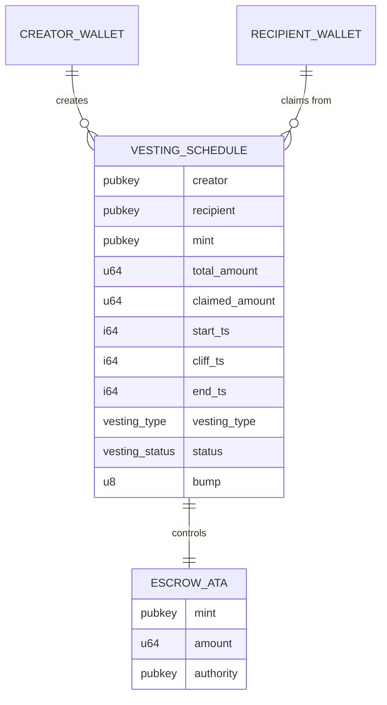
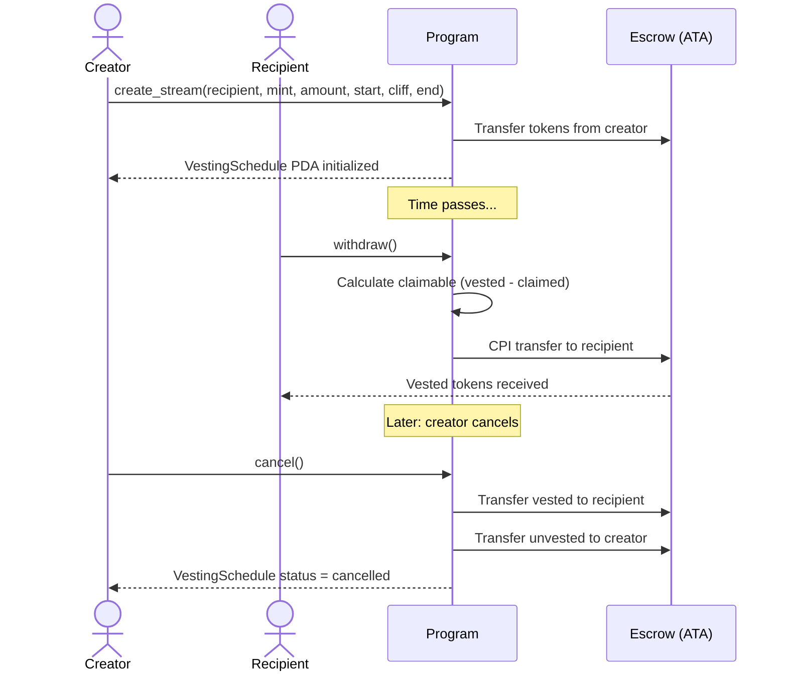
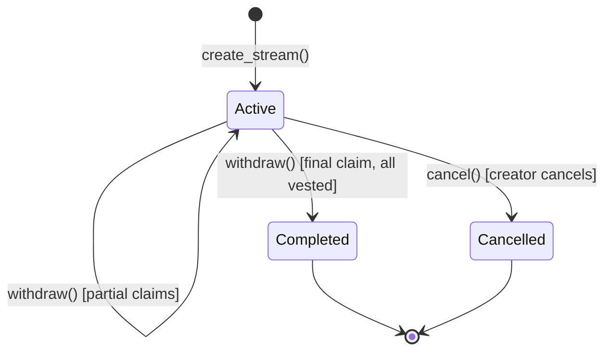

# Architecture — Solana Token Distribution Protocol

This document describes the on-chain protocol architecture: account model, PDA seeds, program instructions, data flow, events, and error reference.

*This document describes the planned protocol architecture. The implementation is in progress — details may change during development.*

## Contents

1. [Account structure](#account-structure)
2. [PDA seeds](#pda-seeds)
3. [Program instructions](#program-instructions)
4. [Data flow](#data-flow)
5. [Edge cases](#edge-cases)
6. [Events](#events)
7. [Error reference](#error-reference)

---

## Account structure

The protocol uses three on-chain account types:

- **VestingSchedule PDA** — stores the metadata for a single vesting stream
- **Escrow Token Account** — an Associated Token Account (ATA) that holds the locked tokens

The VestingSchedule PDA is the authority over the escrow. Only the program (signing with PDA seeds via `invoke_signed`) can move tokens out.

### Entity relationship



### VestingSchedule PDA

One per vesting stream. Created at `create_stream` time and closed when the stream completes or is cancelled.

| Field | Type | Description |
|---|---|---|
| `creator` | `Pubkey` | Wallet that funded the stream. Only this wallet can cancel. |
| `recipient` | `Pubkey` | Wallet that receives vested tokens. Only this wallet can withdraw. |
| `mint` | `Pubkey` | SPL token mint address (e.g. USDC, project token). |
| `total_amount` | `u64` | Total tokens locked in this stream. |
| `claimed_amount` | `u64` | Tokens already withdrawn by the recipient. |
| `start_ts` | `i64` | Unix timestamp when vesting begins. |
| `cliff_ts` | `i64` | Unix timestamp of the cliff date. Set to `0` if no cliff. |
| `end_ts` | `i64` | Unix timestamp when the full amount is vested. |
| `vesting_type` | `VestingType` | Enum: `Cliff` or `Linear`. Milestone is future scope. |
| `status` | `VestingStatus` | Enum: `Active`, `Completed`, or `Cancelled`. |
| `bump` | `u8` | PDA bump seed, stored to avoid re-derivation. |

### Escrow Token Account

A standard ATA owned by the VestingSchedule PDA. Created at `create_stream` time using the Associated Token Program. Closed when the stream completes or is cancelled, returning rent-exempt SOL to the creator.

Using an ATA instead of a custom token account gives us standard wallet compatibility — wallets and explorers already know how to display ATAs.

### CreatorConfig PDA

One per creator wallet. Stores the next vesting count and is created lazily on the first `create_stream` call.

| Field | Type | Description |
|---|---|---|
| `creator` | `Pubkey` | Creator wallet address |
| `vesting_count` | `u64` | Next sequential nonce for this creator's streams |

---

## PDA seeds

| Account | Seeds |
|---|---|
| VestingSchedule | `["vesting", creator_pubkey, mint_pubkey, vesting_count (u64 LE)]` |
| Escrow (ATA) | `AssociatedToken(vesting_schedule_pda, mint)` |
| CreatorConfig | `["creator_config", creator_pubkey]` |

The `vesting_count` is a sequential nonce that lets the same creator fund multiple streams for the same recipient and token without address collisions. It increments on each `create_stream` call.

VestingSchedule PDA derivation:

```
seeds = [b"vesting", creator.key.as_ref(), mint.key.as_ref(), &vesting_count.to_le_bytes()]
```

---

## Program instructions

### create_stream

Initialize a new vesting stream. The creator specifies the recipient, token mint, amount, and time parameters. Tokens are transferred from the creator's token account into a newly created escrow ATA.

- **Caller:** Creator
- **Parameters:** `recipient`, `mint`, `total_amount`, `start_ts`, `cliff_ts`, `end_ts`, `vesting_type`
- **Accounts:** Creator (signer), CreatorConfig PDA (init if needed), VestingSchedule PDA (init), Escrow ATA (init), Creator Token Account, Token Program, Associated Token Program, System Program

**Validations:**

- `total_amount > 0`
- `end_ts > start_ts`
- `cliff_ts == 0 || (cliff_ts > start_ts && cliff_ts <= end_ts)`
- Creator token balance ≥ `total_amount`
- Caller is the `creator` on the CreatorConfig account

**Effects:** Create CreatorConfig PDA if it does not exist. Create VestingSchedule PDA with status `Active`. Transfer `total_amount` tokens to escrow ATA. Emit `StreamCreated` event. Increment `vesting_count` on CreatorConfig.

**Error codes:** `ZeroAmount`, `InvalidTimeRange`, `InsufficientBalance`

### withdraw

Let the recipient claim vested tokens. Calculates claimable amount based on current clock time, the vesting curve, and amount already claimed.

- **Caller:** Recipient
- **Parameters:** none (all context on the VestingSchedule account)
- **Accounts:** Recipient (signer), VestingSchedule PDA (mutable), Escrow ATA (mutable), Recipient Token Account, Token Program, Associated Token Program, Clock Sysvar

**Validations:**

- Caller is the `recipient` on the VestingSchedule
- Stream status is `Active`
- Current clock ≥ `cliff_ts` (if cliff is set)
- Calculated claimable > 0

**Claimable calculation:**

- **Linear:** `claimable = min(total_amount * elapsed / duration, total_amount) - claimed_amount`
- **Cliff:** Before cliff → 0. After cliff → `total_amount - claimed_amount`

**Effects:** Transfer claimable tokens via CPI. Update `claimed_amount`. If fully claimed, set status to `Completed`. Emit `TokensWithdrawn` event.

**Error codes:** `Unauthorized`, `StreamNotActive`, `CliffNotReached`, `NothingVested`

### cancel

Let the creator cancel an active stream. Recipient receives whatever has vested (including unclaimed). Creator gets back the unvested portion. Both accounts are closed.

- **Caller:** Creator
- **Parameters:** none
- **Accounts:** Creator (signer), VestingSchedule PDA (mutable, close), Escrow ATA (mutable, close), Recipient Token Account, Creator Token Account, Token Program, Clock Sysvar

**Validations:**

- Caller is the `creator` on the VestingSchedule
- Stream status is `Active`

**Effects:** Calculate vested amount (same formula as withdraw). Transfer vested → recipient. Transfer unvested → creator. Close escrow ATA (rent to creator). Close VestingSchedule PDA (rent to creator). Set status to `Cancelled`. Emit `StreamCancelled` event.

**Error codes:** `Unauthorized`, `StreamNotActive`

---

## Data flow

### Happy path lifecycle



### VestingSchedule state machine



### Clock dependency

Vesting calculations depend on Solana's `Clock` sysvar `unix_timestamp`. No oracle needed — the blockchain itself provides timestamps. Solana slots are roughly 400ms, giving per-second resolution for streaming.

### CPI pattern

All token transfers use `invoke_signed` with the VestingSchedule PDA's seeds. The PDA is the authority over the escrow ATA, so the program must prove it is the one authorizing the transfer. Seeds are reconstructed from the stored `bump` and account fields.

---

## Edge cases

| # | Scenario | Input | Expected behavior | Error |
|---|---|---|---|---|
| 1 | Withdraw before cliff | `clock < cliff_ts` | Reject claim | `CliffNotReached` |
| 2 | Cancel mid-stream | 40% vested | 40% → recipient, 60% → creator | — |
| 3 | Zero amount create | `total_amount = 0` | Reject creation | `ZeroAmount` |
| 4 | Fully vested, unclaimed | `end_ts` passed, `claimed = 0` | Cancel allowed (vested → recipient) | — |
| 5 | Same recipient and creator | `recipient == creator` | Allowed — self-scheduling | — |
| 6 | Multiple streams, same pair | Duplicate seeds | Differentiated by `vesting_count` nonce | — |
| 7 | No recipient ATA | Recipient has no token account | Created via CPI at withdraw time | — |
| 8 | Withdraw after fully claimed | `claimed == total_amount` | Reject | `NothingVested` |
| 9 | Cancel already-cancelled stream | Status is `Cancelled` | Reject | `StreamNotActive` |
| 10 | Overflow handling | Large `total_amount` | Safe math via checked arithmetic | — |

---

## Events

Events are emitted via Anchor's `emit!` macro and parsed from transaction logs by the SDK.

| Event | Fields |
|---|---|
| `StreamCreated` | `creator`, `recipient`, `mint`, `total_amount`, `start_ts`, `cliff_ts`, `end_ts` |
| `TokensWithdrawn` | `recipient`, `vesting_schedule`, `amount`, `remaining` |
| `StreamCancelled` | `creator`, `recipient`, `vested_to_recipient`, `returned_to_creator` |

---

## Error reference

| Error | Cause |
|---|---|
| `ZeroAmount` | `total_amount` is 0 |
| `InvalidTimeRange` | `end_ts <= start_ts` |
| `CliffNotReached` | Withdraw attempted before `cliff_ts` |
| `NothingVested` | Withdraw when calculated claimable = 0 |
| `StreamNotActive` | Withdraw/cancel on a completed or cancelled stream |
| `Unauthorized` | Non-creator calling cancel, or non-recipient calling withdraw |
| `InsufficientBalance` | Creator token balance < `total_amount` at creation time |
