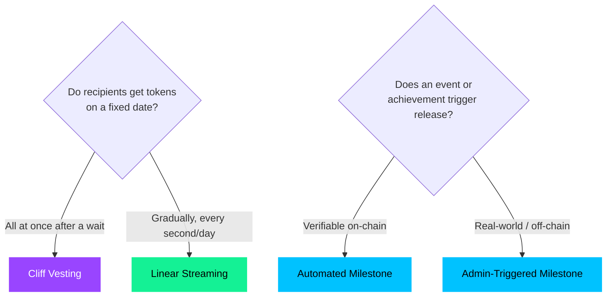

# Research — Solana Token Distribution Protocol

This document captures the Week 1 and Week 2 research that shaped Solana TDP: vesting mechanics, competitive landscape, market gaps, user research, product positioning, and the design decisions that followed.

## Contents

1. [Vesting types](#vesting-types)
2. [The Solana program model](#the-solana-program-model)
3. [Development tooling decisions](#development-tooling-decisions)
4. [Competitive landscape](#competitive-landscape)
5. [Market gaps](#market-gaps)
6. [User research](#user-research)
7. [Product positioning](#product-positioning)
8. [BD insights](#bd-insights)

---

## Vesting types

Token vesting aligns incentives by releasing tokens to recipients over time rather than all at once. Three mechanisms dominate:

### Cliff vesting

Nothing is released until a specific date — the "cliff." After the cliff, a lump sum unlocks (often followed by linear vesting).

- **Use case:** Team & founders (1-year cliff + 3-year linear is standard), investor tranches, advisor grants
- **On-chain complexity:** Low — just timestamps to store and compare
- **Example:** 1,200,000 tokens with 12-month cliff and 24-month linear vest. Nothing for month 1–12. At month 12, first 50,000 unlock. From month 12 to 36, another 50,000 unlocks each month.

### Linear / streaming vesting

Tokens release at a steady, constant rate — per second, per day, or per epoch. No sudden jumps.

- **Use case:** Contributor salaries, DAO grants, ecosystem fund disbursements
- **On-chain complexity:** Medium — requires per-second accrual calculation using Solana's Clock sysvar
- **Example:** 100,000 tokens streamed evenly over 365 days = 0.003171 tokens/second

### Milestone-based vesting

Tokens unlock when a specific event occurs, not when time passes.

- **Use case:** Bounty programs, investor tranches tied to product milestones, ecosystem grants
- **On-chain complexity:** High — requires oracle-fed or admin-triggered verification
- **Status:** Out of scope for MVP, but the account layout is designed to accommodate it later

### Decision tree

**MVP recommendation:** Start with cliff + linear. These cover the vast majority of use cases and require no oracle infrastructure.

---

## The Solana program model

Solana TDP relies on three Solana primitives: **Accounts** (everything on Solana is an account — wallets, programs, stored data), **PDAs** (program-derived addresses with no private key, enabling trustless escrow), and **CPIs** (cross-program invocations to transfer tokens, create ATAs, and allocate accounts). See [ARCHITECTURE.md](./ARCHITECTURE.md) for how these map to the protocol.

## Development tooling decisions

### Framework: Anchor vs Pinocchio

| | Anchor | Pinocchio |
|---|---|---|
| **Approach** | Macro-based eDSL, automatic serialization, IDL generation | Lower-level, zero-copy deserialization, manual validation |
| **DX** | High — `#[account]`, `#[derive(Accounts)]`, `anchor build` emits IDL | Low — manual account checking, discriminator handling |
| **Program size** | Larger binaries | Significantly smaller |
| **Client generation** | Automatic via IDL | Manual |
| **Best for** | Teams building Solana familiarity, rapid development | Experienced teams optimizing for program size |

**Decision: Anchor 0.32.1.** The team is building Solana familiarity and Anchor's guardrails (account validation, IDL generation, CPI macros) reduce the surface area for mistakes. If program size becomes a constraint later, Pinocchio is the path to evaluate.

### Testing tools

| Tool | Status | Use case |
|---|---|---|
| **LiteSVM** | Active (recommended) | Fast, in-process testing — Rust, TS/JS, Python |
| **anchor-litesvm** | Active | Anchor-compatible testing without a validator |
| **solana-test-validator** | Active | When you need a real local RPC node |
| **Bankrun** | Deprecated (Mar 2025) | Migrate to LiteSVM |
| **solana-program-test** | Legacy | Existing projects OK; new projects → LiteSVM |

**Decision:** TypeScript tests with anchor-litesvm + jest. Tests use `fromWorkspace` to bootstrap the SVM and `LiteSVMProvider` for the Anchor provider. No local validator needed for most tests. Use solana-test-validator only when a real RPC node is required.
## Competitive landscape

Four major vesting solutions exist on Solana:

| Protocol | Cliff | Linear | Milestone | Multi-Recipient | Fee | Audited |
|---|---|---|---|---|---|---|
| **Streamflow** | Yes | Yes | No | Yes (60–300/batch) | % of tokens | Partial |
| **Sablier (SolSab)** | Yes | Yes | No | No (1/stream) | Free | Cantina |
| **Magna** | Yes | Yes | Yes (API) | Yes (API) | Enterprise | Unknown |
| **Smithii** | Yes | Yes | No | No (1/contract) | ~0.1 SOL/tx | Halborn + CoinFabrik |

### Streamflow

Best web UX on Solana for time-based vesting. Clean step-by-step flow, CSV upload for bulk recipients, email notifications. Limitations: no milestone support, schedules cannot be modified after creation, batch capped at 60–300 recipients.

### Sablier (SolSab)

Most mature open-source codebase. Free, audited multiple times by Cantina. Streams represented as NFTs. Limitations: one stream per transaction, UI less polished, documentation assumes blockchain literacy.

### Magna

Only solution with milestone support, but via hybrid off-chain API model. $3.5B+ TVL. Limitations: hybrid model reduces transparency, not open-source, enterprise pricing.

### Smithii

Simplest no-code experience. 1-click vesting. LP token vesting is a unique differentiator. Limitations: single recipient per contract, no SDK, limited flexibility.

**Our interpretation:** Nobody occupies the "high features, high UX" quadrant with all three vesting types, batch creation, and a clean interface. That is where Solana TDP aims.

---

## Market gaps

Six gaps emerged from our analysis:

1. **Feature gap** — No existing Solana protocol supports milestone-based vesting with on-chain trigger verification
2. **Scale gap** — Batch creation is capped (60–300 recipients) or single-stream only. A 500-person team needs multiple transactions
3. **Flexibility gap** — None of the four solutions let you modify a schedule after creation (amount, duration, cliff)
4. **UX gap** — Current tools assume blockchain literacy. A non-technical founder cannot use them
5. **Transparency gap** — Recipients have no real-time visibility into vesting status. No universal "Vesting Explorer"
6. **Reporting gap** — No built-in CSV export or quarterly reporting. DAO treasurers must manually compile data

---

## User research

We conducted 5 interviews with founders and builders on Solana. Every conversation confirmed the same core pattern: founders struggle with tokenomics planning *before* they even get to the engineering. Names have been changed for anonymity.

### Who we talked to

| Pseudonym | Role | Platform |
|---|---|---|
| Alex | Founder / Trader / Web3 Dev | Solana crowdfunding platform |
| Jordan | Freelancer (Design & Illustration) | Runs F&B + freelancing |
| Sam | Founder | VTuber launchpad |
| Taylor | Founder | AI Agent Trading Intelligence |
| Morgan | Incubator lead | Launchpad and incubator |

### Key findings

**Alex:** "The biggest problem is calculate and simulate. Founders struggle here before they even get to token engineering." Builds crowdfunding platform on Solana. Still calculates everything in Excel — token vesting dates, TGE dates, lock periods. Wants a platform that can simulate distribution and stress-test bonding curves.

**Jordan:** "The process is confusing for non-technical people. That slows adoption. Security and accuracy are the main concerns." Finds current platforms confusing from a UX perspective.

**Sam:** Not deeply familiar with TDPs — shows the market extends beyond current tool users. Saw potential in using vesting to reward users who support creators on his platform — a use case we had not considered.

**Taylor:** "If we want to integrate custom smart contracts, that is where it gets difficult." Uses Streamflow for every product launch but hits limits when custom logic is needed.

**Morgan:** "The UI/UX is not friendly for non-technical users." Every project in their incubator uses Streamflow but the learning curve is steep.

---

## Product positioning

### Product explanation

A platform that helps founders plan, simulate, and automate their token vesting schedules without risky spreadsheets or complex code.

### Positioning angles

1. **Web3 founders** — "Launch your token with smarter distribution planning and automated vesting in one platform."
2. **Non-technical owners** — "Simplify token distribution with a system built for teams that do not write smart contracts."
3. **Investors & launchpads** — "Gain confidence in token launches through simulation, stress testing, and transparent distribution strategies."

### Strategic recommendation

**"Simulate Before You Launch."** Every interview confirmed founders struggle with tokenomics planning before engineering. Our primary value proposition is not "automate vesting" (Streamflow already does that). It is "model your tokenomics, stress-test your unlock schedule, and catch dump risk before you go live." The simulator is the wedge. The vesting protocol is the follow-through.

### Go-to-market metrics (pre-launch)

| Metric | Target |
|---|---|
| Impressions (X, LinkedIn) | 5,000+ |
| Engagements | 500+ |
| Click-through rate | 3–5% |
| Waitlist signups | 50+ |

---

## BD insights

### Additional findings

- **Fee transparency** — Current fee models are opaque. Founders do not know what they are paying until deep in the process
- **Cross-sector utility** — Token distribution is a cross-sector primitive, not just DeFi. AI platforms, creator economies, and launchpads all need it
- **Custom smart contracts** — Power users need the ability to integrate custom logic and CPI into the protocol from their own programs
