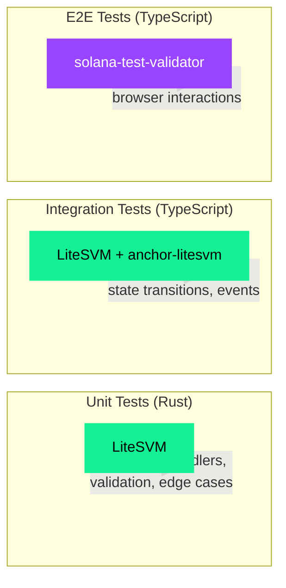
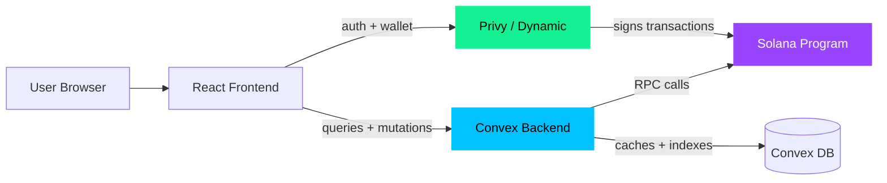

# Tooling — Solana Token Distribution Protocol

Tooling decisions, testing strategy, code conventions, and repository organization for Solana TDP.

## Contents

1. [Anchor vs Pinocchio](#anchor-vs-pinocchio)
2. [Testing tools](#testing-tools)
3. [Fullstack architecture](#fullstack-architecture)
4. [Repository organization](#repository-organization)
5. [Code conventions](#code-conventions)
6. [Key dependencies](#key-dependencies)

---

## Anchor vs Pinocchio

| | Anchor 1.0 | Pinocchio |
|---|---|---|
| **Approach** | Macro-based eDSL, automatic serialization, IDL generation | Lower-level, zero-copy deserialization, manual validation |
| **DX** | High — `#[account]`, `#[derive(Accounts)]`, `anchor build` emits IDL | Low — manual account checking, discriminator handling |
| **Program size** | Larger binaries | Significantly smaller |
| **Client generation** | Automatic via IDL | Manual |
| **Best for** | Teams building Solana familiarity, rapid development | Experienced teams optimizing for program size |

**Decision: Anchor 1.0.** The team is building Solana familiarity and Anchor's guardrails (account validation, IDL generation, CPI macros) reduce the surface area for mistakes. If program size becomes a constraint later, Pinocchio is the path we would evaluate.

---

## Testing tools

### Tool status

| Tool | Status | Use case |
|---|---|---|
| **Anchor** | Active | Main framework for building Solana programs |
| **LiteSVM** | Active (recommended) | Fast, in-process testing — Rust, TS/JS, Python |
| **anchor-litesvm** | Active | Anchor-compatible testing without a validator |
| **solana-test-validator** | Active | When you need a real local RPC node |
| **Bankrun** | Deprecated (Mar 2025) | Migrate to LiteSVM |
| **solana-program-test** | Legacy | Existing projects OK; new projects → LiteSVM |
| **Pinocchio** | Active (specialized) | Lower-level alternative to Anchor for smaller programs |

### Testing layer strategy



**Rule of thumb:** Write program logic tests in LiteSVM + anchor-litesvm. Use solana-test-validator only for integration tests that touch RPC methods or multiple processes. Do not use Bankrun — it is deprecated.

### LiteSVM key capabilities

- Time travel via `warp_to_slot()`
- Arbitrary account state seeding
- Direct sysvar manipulation
- Compute budget control
- Built-in System Program and SPL Token programs

### Install

```toml
# Cargo.toml (dev-dependencies)
[dev-dependencies]
anchor-litesvm = "0.4"
litesvm = "0.11"
litesvm-token = "0.11"
litesvm-utils = "0.4"
```

```json
// package.json (devDependencies)
{
  "anchor-litesvm": "^0.2.1",
  "@coral-xyz/anchor": "^0.31.1",
  "@solana/web3.js": "^1.98.4"
}
```

---

## Fullstack architecture

### Hybrid dApp model

Solana TDP uses a hybrid architecture: on-chain for token logic and custody, hosted backend for user management, caching, and notifications.



### What lives where

| Concern | Layer | Where |
|---|---|---|
| Token custody & vesting logic | On-chain | Solana program (Anchor) |
| User authentication | Wallet service | Privy / Dynamic |
| Wallet provisioning | Wallet service | Privy / Dynamic |
| Transaction signing | Wallet service → On-chain | Privy / Dynamic + user approval |
| Vesting schedule indexing | Backend | Convex (sync from chain) |
| Dashboard real-time data | Backend | Convex reactive queries |
| Email notifications | Backend | Convex scheduled functions |
| User preferences | Backend | Convex database |
| Tokenomics simulator | Frontend | React (pure client-side math) |

### Wallet abstraction

Evaluated Privy, Dynamic, Turnkey, Crossmint, Web3Auth, and Openfort. Leaning toward Privy or Dynamic:

- Both support Solana embedded wallets with social login
- Both have free tiers and React SDKs
- Privy has Stripe integration (fiat onramps)
- Dynamic has best multi-wallet UX (Phantom + embedded)

### Backend

Evaluated Convex, Supabase, Firebase, and PocketBase. Leaning toward **Convex**:

- TypeScript-native with end-to-end type safety
- Reactive queries — dashboard reflects vesting changes in real-time
- Free tier (1M calls/mo) covers an MVP
- Natural fit: vesting schedules change state over time and the dashboard should update automatically

---

## Repository organization

### Monorepo vs polyrepo

| Feature | Monorepo | Polyrepo |
|---|---|---|
| **Project phase** | Early to mid-stage. Rapid iteration, integrated teams. | Late-stage / enterprise. Independent teams. |
| **Team coordination** | High — coordinated changes in one commit | Low — separate PRs and version bumps |
| **Dependency management** | Trivial — all in one place | Complex — versioning across repos |
| **Access control** | Coarse | High — per-repo granularity |
| **Git performance** | Degrades with size | Stays fast |

**Decision: Monorepo (pnpm workspaces).** We are a small team building a full-stack protocol. The ability to change a program instruction and the corresponding frontend client in one commit outweighs the overhead. We can split out stable contract repos later if the project grows.

### Program file layout

```
apps/
├── solana-tdp-anchor/
│   ├── programs/tdp/src/
│   │   ├── lib.rs              # Program entry + declare_id!
│   │   ├── error.rs            # Custom error codes
│   │   ├── event.rs            # Anchor event definitions
│   │   ├── state/              # Account structs (VestingSchedule, enums)
│   │   └── instructions/       # Instruction handlers
│   │       ├── mod.rs
│   │       ├── create_vesting.rs
│   │       ├── withdraw.rs
│   │       └── cancel.rs
│   └── tests/
│       ├── vesting.000.create.test.ts
│       ├── vesting.001.withdraw.test.ts
│       ├── vesting.002.cancel.test.ts
│       └── utils.ts
├── web/                         # React frontend
packages/
└── solana-tdp-sdk/              # TypeScript SDK
    └── src/
        ├── index.ts
        ├── pda.ts               # PDA derivation helpers
        ├── events.ts            # Event parsing
        ├── types/               # Generated types from IDL
        └── idl/                 # Program IDL
```

### File rules

- `state/` — Account structs and enums only. No logic.
- `instructions/` — One file per instruction handler. Each file contains accounts struct, validation, and handler function.
- `error.rs` — All custom Anchor error codes with descriptive messages.
- `event.rs` — All events emitted by the program. One struct per event.

---

## Code conventions

| What | Convention | Example |
|---|---|---|
| Test files | `vesting.NNN.instruction.test.ts` | `vesting.000.create.test.ts` |
| PDA seeds | Lowercase static strings | `"vesting"`, not `"VestingSchedule"` |
| Instruction files | Match instruction name exactly | `create_vesting.rs` |
| TypeScript hooks | Kebab-case | `use-vesting-schedule.ts` |
| SDK entry | Single re-export from `index.ts` | Everything imported from one entry point |

### Test numbering

Test files are numbered by instruction execution order, not alphabetical:

```
vesting.000.create.test.ts     # runs first — stream must exist
vesting.001.withdraw.test.ts   # runs second — claim vested tokens
vesting.002.cancel.test.ts     # runs third — cancel mid-stream
```

This mirrors the natural lifecycle and makes dependencies obvious.

### SDK conventions

The TypeScript SDK wraps the program IDL and provides helpers for common operations:

- **PDA helpers** — `getVestingSchedulePda(creator, mint, count, programId)` returns `[PublicKey, bump]`
- **Event parsing** — `parseEvents(provider, program, txSignature)` returns decoded event objects from transaction logs
- **Types** — Generated from the Anchor IDL; re-exported from `index.ts`

### Anchor.toml

```toml
[provider]
cluster = "localnet"

[scripts]
test = "yarn run ts-mocha -p ./tsconfig.json tests/**/*.ts"
```
